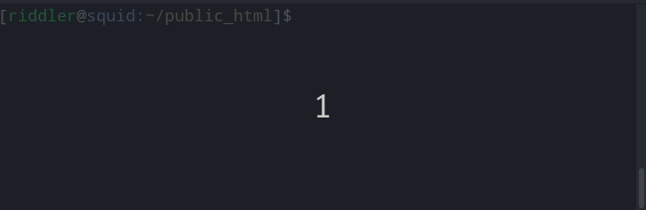

# Overview

It is a bash script for the fast enabling/disabling Xdebug.



**Prerequisites**
1. Ubuntu
2. Font Awesome
     ```bash
     apt install fonts-font-awesome gnome-tweaks
     ```
     Alt+F2 > gnome-tweaks > Fonts > Monospace Text = SourceCodePro+PowerLine+Awesome Regular Regular    11


# Installation

1. Clone repository
   ```bash
   git clone https://github.com/yutv/xdebug-toggle
   cd xdebug-toggle
   ```
2. Install xdebug-toggle
   ```bash
   sudo ./install.sh
   ```
2. Insert the following line into ~/.bashrc    
   ```bash
   export PS1=$(echo "$PS1" | sed -E 's/(\])(\\\$)/\1\\[\\e[0;38;05;197m\\]$(ps1-xdebug-status)\\[\\e[0m\\]\2/')
   ```
3. Allow xdebug to be run as su without password
   ```bash
   sudo visudo
   yutv ALL = NOPASSWD: /usr/local/bin/xdebug
   ```
   where `yutv` is a user name

4. Reconnect SSH/Bash Terminal 
    
# Usage

```bash
xdebug # enable Xdebug
xdebug # disable Xdebug
```
